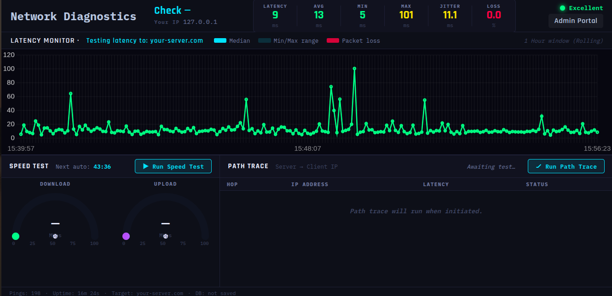
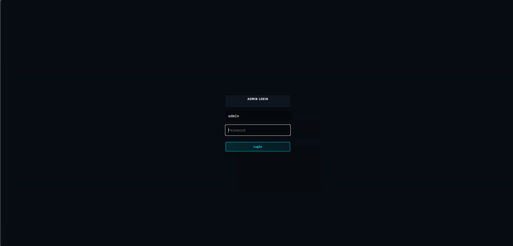

# LatencyHub – Real-Time Network Diagnostics Tool

## Description

LatencyHub is a browser-based latency monitoring and network diagnostics tool. It provides a real-time visualization of network performance directly from your browser, removing the need for local desktop installations while providing critical insight into connection stability.

By mimicking Smokeping style visualizations and offering comprehensive metrics like standard deviation jitter and packet loss, this node backend enables robust network testing.

## Features

* **Real-time latency monitoring**: Uses targeted HTTP requests at a steady 5s interval to measure RTT.
* **Jitter calculation**: Calculates true standard deviation for an accurate reflection of network variance.
* **Packet loss visualization**: Instantly identify connection drops via red markers alongside normal latency measurements.
* **Bandwidth Test**: Conduct fast, localized download & upload speed testing.
* **Traceroute with reverse DNS**: Identify routing paths and potential bottlenecks easily.
* **TCP fallback support**: Uses TCP port 80 traceroute when traditional ICMP routing restricts discovery.
* **Historical result storage**: Backed by a SQLite database ensuring check data persists and can be referenced.
* **Admin dashboard**: Easy UI administration allowing engineers to search by Check ID.

## How It Works

1. **Browser measures RTT**: The client browser measures Round Trip Time using HTTP requests against the backend server.
2. **Backend Services**: The Node HTTP server processes bandwidth endpoints, traceroutes, and saves analytics.
3. **Hybrid Model**: Web frameworks natively restrict traditional ICMP (Ping), so this tool accurately uses zero-cache HTTP endpoints to test genuine browser latency!

## Installation

No client installation is required. To set up the reporting target:

1. Clone repo:
   ```bash
   git clone <your-repo>
   cd <project_dir>
   ```

2. Install dependencies:
   ```bash
   npm install
   ```

3. Set your target environment variable:
   ```bash
   export TARGET_HOST="your-server-ip-or-domain"
   ```

4. Run the node app:
   ```bash
   node server.js
   ```

## Nginx (Optional)

It is heavily recommended to use Nginx as a reverse proxy for production configurations:

```nginx
server {
    listen 80;
    server_name your-server-ip-or-domain;

    location / {
        proxy_pass http://localhost:3000;
        proxy_http_version 1.1;
        proxy_set_header Upgrade $http_upgrade;
        proxy_set_header Connection 'upgrade';
        proxy_set_header Host $host;
        proxy_cache_bypass $http_upgrade;
    }
}
```

## Configuration

* **Server Target Domain**: You can change what target domain is printed and recorded by the client. Simply provide the `TARGET_HOST` environment variable to `server.js` before starting the execution. 
* **Frontend Overrides**: Advanced users can also edit `public/config.js` manually to override the fallback if the server is hidden behind a complex reverse proxy setup without passing environments.

## Screenshots

### Dashboard


### Admin Portal


## Security Note

* This tool measures HTTP-based latency via browser requests, and thus requires port availability (unlike generic ICMP).
* All Traceroutes (ICMP & TCP Fallback) execute cleanly on the Node target backend.

## License

MIT License
